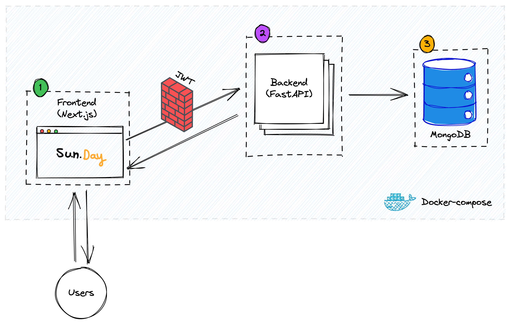

<p align="center">

</p>

# Sun.Day Web Application

Sun.Day this is a simple web application that I developed in part of "EASS-HIT-2022" course,
I developed it to manage my clients and the tasks of each of them.



## Requirements

- Docker 🐳
- docker-compose

## 🌱 Getting Started

### Installation

To run this project, you will need to do the following steps:

1. Clone the repo
   ```sh
   git clone https://github.com/EASS-HIT-2022/sun.day.git
   ```
2. Go to the main folder of the project: `cd sun.day/`
3. Run all containers (frontend, backend, database) with docker-compose
   ```sh
   docker-compose up
   ```
4. Enjoy! 🤩 ☁️

   Sun.Day Application is on the air: http://localhost:3000

## Screenshots


https://user-images.githubusercontent.com/33636546/175826695-d6354ba7-0bd6-4f83-a563-c7797ed20e4f.mp4

## Roadmap

- [x] First microservice: Backend with FastAPI & Pydantic
- [x] Second microservice: Frontend with React.js
  - [x] Welcome Page
  - [x] Login / Register
  - [x] Dashboard
  - [x] Customers
  - [x] Single Customer
  - [x] Search / Add / Edit / Delete Customer
- [x] Third microservice: Database MongoDB

```sh
Project tree:

.
├── README.md
├── docker-compose.yml
├── frontend
└── backend
    ├── Dockerfile
    ├── __init__.py
    ├── core
    │   ├── __init__.py
    │   ├── config.py
    │   ├── hashing.py
    │   ├── jwttoken.py
    │   └── oauth.py
    ├── db
    │   ├── __init__.py
    │   └── database.py
    ├── main.py
    ├── models
    │   ├── __init__.py
    │   ├── ObjectId.py
    │   ├── customers.py
    │   ├── tasks.py
    │   ├── tokens.py
    │   └── users.py
    ├── requirements.txt
    └── routers
        ├── __init__.py
        └── api
            └── v1
                ├── __init__.py
                ├── customers.py
                ├── tasks.py
                └── users.py
                
```

## Built With

**Client:** React (Next.js), TailwindCSS

**Server:** Python, FastAPI

**Database:** MongoDB

## Support

For support, email nivh@gmail.com or join our Slack channel.
